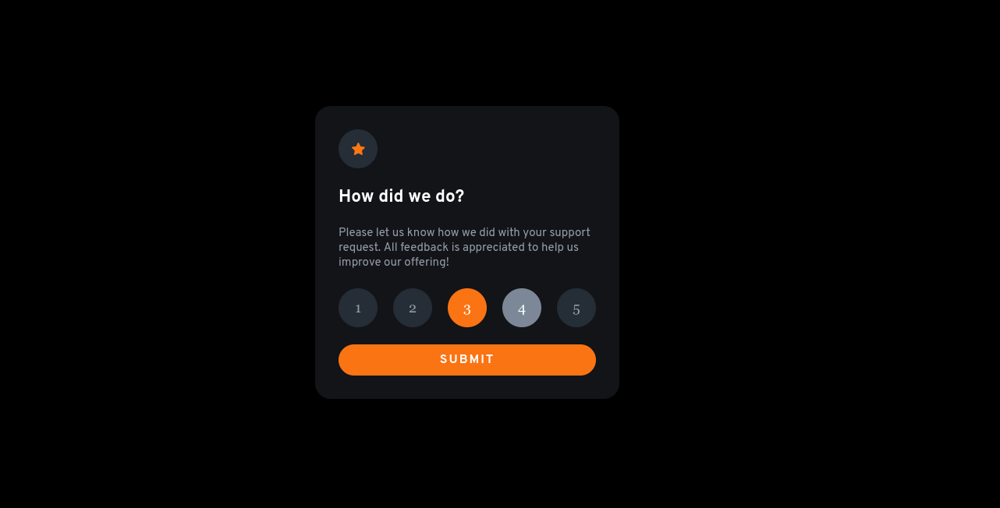
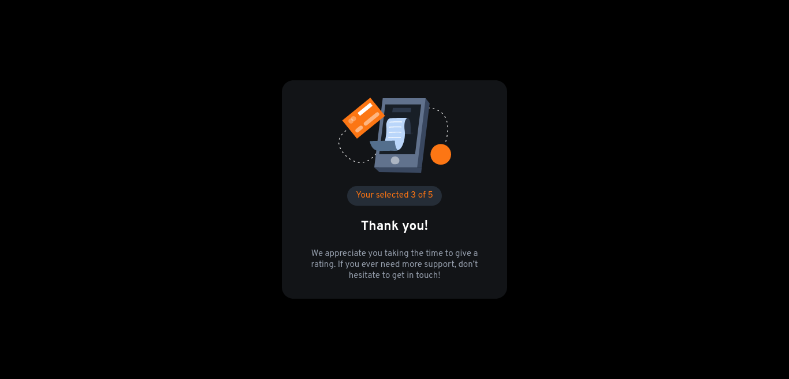

# Frontend Mentor - Interactive rating component solution

This is a solution to the [Interactive rating component challenge on Frontend Mentor](https://www.frontendmentor.io/challenges/interactive-rating-component-koxpeBUmI). Frontend Mentor challenges help you improve your coding skills by building realistic projects.

## Table of contents

- [Overview](#overview)
  - [The challenge](#the-challenge)
  - [Screenshot](#screenshot)
  - [Links](#links)
- [My process](#my-process)
  - [Built with](#built-with)
  - [Useful resources](#useful-resources)
- [Author](#author)
- [Project setup](#project-setup)

## Overview

### The challenge

Users should be able to:

- View the optimal layout for the app depending on their device's screen size
- See hover states for all interactive elements on the page
- Select and submit a number rating
- See the "Thank you" card state after submitting a rating

### Screenshot




### Links

- Solution URL: [Add solution URL here](https://your-solution-url.com)
- Live Site URL: [Add live site URL here](https://your-live-site-url.com)

## My process

### Built with

- Semantic HTML5 markup
- SASS
- Flexbox
- Mobile-first workflow
- [Vue.js](https://vuejs.org/) - JS framework
- [Vue CLI](https://cli.vuejs.org/) - Standard Tooling for Vue.js Development
- [Sass](https://sass-lang.com/) - For styles

### Useful resources

- [Vue Style Guide](https://v2.vuejs.org/v2/style-guide/?redirect=true) - This helped me name my components
- [Vue - The Complete Guide (incl. Router & Composition API)](https://www.udemy.com/course/vuejs-2-the-complete-guide/) - This helped me with $emit

## Author

- Website - [Ramon A. Pereira](https://github.com/RamonAPereira)
- Frontend Mentor - [@ramonapereira](https://www.frontendmentor.io/profile/RamonAPereira)
- Twitter - [@ramonnzd](https://www.twitter.com/ramonnzd)

## Project setup

```
npm install
```

### Compiles and hot-reloads for development

```
npm run serve
```

### Compiles and minifies for production

```
npm run build
```

### Lints and fixes files

```
npm run lint
```

### Customize configuration

See [Configuration Reference](https://cli.vuejs.org/config/).
